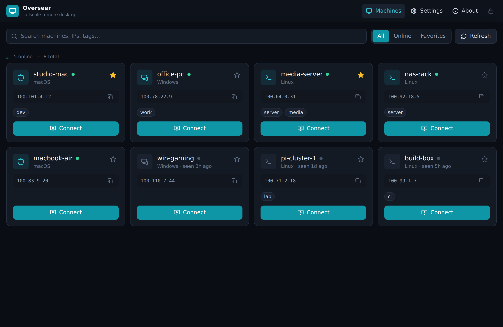
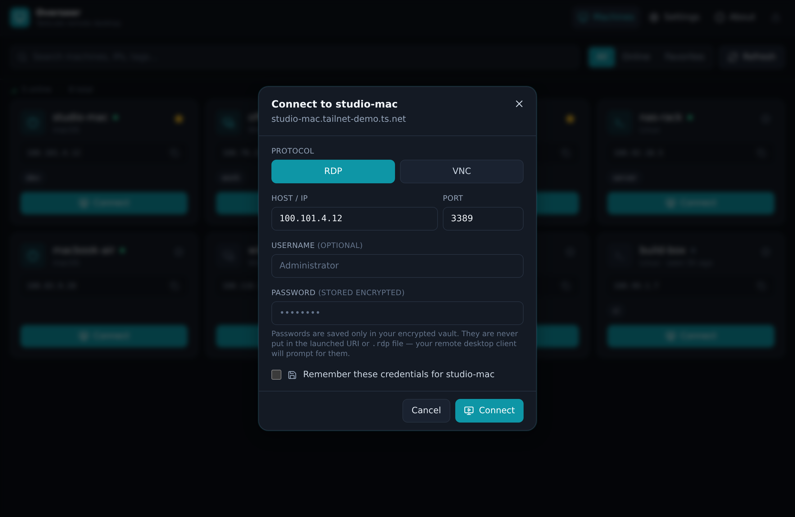

<div align="center">


# Overseer

### The cross-platform Tailscale remote desktop manager

**Discover every machine on your tailnet and connect over RDP or VNC — from Windows, macOS, Linux, Android, and iOS — with credentials sealed in an encrypted vault.**

[](https://github.com/marius-bughiu/overseer/actions/workflows/ci.yml)
[](https://github.com/marius-bughiu/overseer/releases)
[](LICENSE)
[](https://tauri.app)
[](https://www.rust-lang.org)
[](CONTRIBUTING.md)

[Features](#-features) · [Download](#-download) · [How it works](#-how-it-works) · [Build from source](#-build-from-source) · [Security](#-security) · [Roadmap](#-roadmap) · [Contributing](#-contributing)

</div>

---

## What is Overseer?

**Overseer** is a free, open-source **remote desktop manager built for [Tailscale](https://tailscale.com)**. It automatically lists the machines on your tailnet and lets you launch a secure **RDP** or **VNC** session to any of them in one tap — over Tailscale's encrypted WireGuard® mesh, with no port forwarding, no public IPs, and no exposed RDP ports.

It runs everywhere Tailscale does: **Windows, macOS, Linux, Android, and iOS**. It's a single, fast, native-feeling app built with [**Tauri 2**](https://tauri.app) and Rust — typically under 15 MB, not a 200 MB Electron bundle.

> Think of it as the address book + launcher for all your remote machines, powered by the private network you already trust.

<div align="center">

<br/><sub>The Overseer machine browser — every device on your tailnet, online status, and one-tap connect.</sub>
</div>

## ✨ Features

- 🔍 **Automatic Tailscale discovery** — every device on your tailnet, online/offline status, OS, IPs and ACL tags, with no manual host entry.
- 🖥️ **One-tap RDP & VNC** — pick a machine, pick a protocol, connect. Overseer hands the session to your platform's remote desktop client.
- 🔐 **Encrypted credential vault** — usernames and passwords are stored with [IOTA Stronghold](https://github.com/iotaledger/stronghold.rs), encrypted at rest behind a master password. Passwords are **never** written into launch URIs or `.rdp` files.
- 🌐 **Two discovery modes** — the **Tailscale API** (works on every platform, including mobile) or the local **`tailscale` CLI** (zero config on desktop).
- ⭐ **Favorites, search & filters** — find the machine you need instantly, even across a large tailnet.
- 📋 **Quick copy** — grab a machine's Tailscale IP or MagicDNS name with one click.
- 🪶 **Tiny & native** — Rust + Tauri 2, a real native webview, no Electron, no telemetry.
- 🌙 **Polished dark UI** — designed for the late-night ops session.
- 🆓 **Open source, MIT licensed** — audit it, fork it, ship it.

## 🔑 Why Tailscale + Overseer?

Traditional remote desktop means exposing RDP (port 3389) to the internet — one of the most attacked ports there is — or wrangling a VPN. With Tailscale, every machine gets a stable private `100.x` address reachable only by your devices. **Overseer turns that private mesh into a friendly, searchable remote desktop console.**

| Without Overseer | With Overseer |
| --- | --- |
| Remember IPs / MagicDNS names | Auto-discovered machine list |
| Hand-craft `.rdp` files | One-tap connect |
| Passwords in plaintext config | Encrypted vault |
| Different tools per platform | One app on all 5 platforms |

## 📥 Download

> ⚠️ Overseer is in active early development (`v0.1.x`). Pre-built binaries are published on the [**Releases**](https://github.com/marius-bughiu/overseer/releases) page as they become available. Until then, [build from source](#-build-from-source).

| Platform | Artifact |
| --- | --- |
| Windows | `.msi` / `.exe` installer |
| macOS | `.dmg` (Apple Silicon & Intel) |
| Linux | `.AppImage` / `.deb` / `.rpm` |
| Android | `.apk` / Play Store *(planned)* |
| iOS | App Store / TestFlight *(planned)* |

## 🚀 How it works

1. **Discover** — Overseer asks Tailscale for your devices, either through the [Tailscale REST API](https://tailscale.com/api) (using an access token you provide) or the local `tailscale status` command.
2. **Choose** — you select a machine, a protocol (RDP/VNC), a port, and optionally a saved credential.
3. **Connect** — Overseer builds the correct launch artifact and opens it with the platform's remote desktop client:
   - **Desktop RDP** → generates a `.rdp` file and opens it (`mstsc` on Windows, *Windows App* on macOS).
   - **Mobile RDP** → opens an `rdp://` deep link into the Microsoft Remote Desktop / Windows App client.
   - **VNC (all platforms)** → opens a `vnc://` URL handled by Screen Sharing / RealVNC / your viewer of choice.

All traffic flows over your encrypted Tailscale connection. See [`docs/ARCHITECTURE.md`](docs/ARCHITECTURE.md) for the full design.

<div align="center">

<br/><sub>Choose RDP or VNC, optionally save credentials to the encrypted vault, and connect.</sub>
</div>

## 🛠️ Tech stack

- **[Tauri 2](https://tauri.app)** — cross-platform desktop **and** mobile shell.
- **Rust** — the backend, with a dependency-free [`overseer-core`](crates/overseer-core) crate holding the (unit-tested) discovery and connection logic.
- **React + TypeScript + Vite + Tailwind CSS** — the frontend.
- **IOTA Stronghold** — the encrypted secrets vault.
- **reqwest (rustls)** — the Tailscale API client.

## 🧑‍💻 Build from source

### Prerequisites

- [Node.js](https://nodejs.org) 20+ and npm
- [Rust](https://www.rust-lang.org/tools/install) (stable)
- Platform dependencies for Tauri — follow the official [Tauri prerequisites guide](https://tauri.app/start/prerequisites/) for your OS (on Linux: `webkit2gtk-4.1`, `libgtk-3`, `libsoup-3.0`, etc.).

### Run in development

```bash
git clone https://github.com/marius-bughiu/overseer.git
cd overseer
npm install
npm run tauri dev
```

### Build a release bundle

```bash
npm run tauri build
```

### Mobile (Tauri 2)

```bash
# Android (requires Android SDK/NDK)
npm run tauri android init
npm run tauri android dev

# iOS (requires Xcode, macOS only)
npm run tauri ios init
npm run tauri ios dev
```

### Run the tests

The platform-agnostic core logic is fully unit-tested and builds without any GUI toolchain:

```bash
cargo test -p overseer-core   # Rust core (discovery parsing + URI building)
npm run build                 # type-check + bundle the frontend
npm run lint                  # eslint
```

## 🔒 Security

Security is a first-class concern for a tool that handles remote-access credentials. Highlights:

- Credentials and the Tailscale API token are encrypted at rest in a Stronghold vault, unlocked only by your master password (which is never stored).
- Passwords are **never** embedded in `rdp://` / `vnc://` URIs or `.rdp` files — your remote desktop client prompts for them.
- No telemetry, no analytics, no phone-home.
- A strict Content-Security-Policy and Tauri's capability allowlist scope what the app can do.

Read the full model in [`SECURITY.md`](SECURITY.md), and please report vulnerabilities responsibly (see the same file).

## 🗺️ Roadmap

- [ ] Pre-built signed binaries for all desktop platforms
- [ ] Android & iOS store releases
- [ ] OAuth client support for Tailscale discovery
- [ ] Optional embedded VNC viewer (no external client needed)
- [ ] SSH connections
- [ ] Per-machine connection presets (resolution, gateway, redirects)
- [ ] Connection history & quick-reconnect
- [ ] Wake-on-LAN via a tailnet peer

See the [open issues](https://github.com/marius-bughiu/overseer/issues) and [CONTRIBUTING.md](CONTRIBUTING.md) to help shape it.

## 🤝 Contributing

Contributions are very welcome! Whether it's a bug report, a feature idea, docs, or code — start with [**CONTRIBUTING.md**](CONTRIBUTING.md) and our [**Code of Conduct**](CODE_OF_CONDUCT.md).

## ❓ FAQ

**Does Overseer implement RDP/VNC itself?**
Not yet — it's a *manager* that launches your platform's existing client over Tailscale. An embedded VNC viewer is on the roadmap.

**Do I need to expose RDP to the internet?**
No. That's the whole point. Machines are reached over their private Tailscale addresses.

**Does it work without Tailscale?**
Overseer is built around Tailscale discovery. You can still connect to any host you can type in manually, but discovery requires a tailnet.

**Is my Tailscale token sent anywhere except Tailscale?**
No. It's stored in your local encrypted vault and used only to call `api.tailscale.com`.

## 📄 License

Overseer is released under the [MIT License](LICENSE). © 2026 Marius Bughiu.

> Tailscale and WireGuard are trademarks of their respective owners. Overseer is an independent project and is not affiliated with or endorsed by Tailscale Inc.

<div align="center">
<sub>Built with ❤️ and Rust. If Overseer is useful to you, please ⭐ the repo.</sub>
</div>
